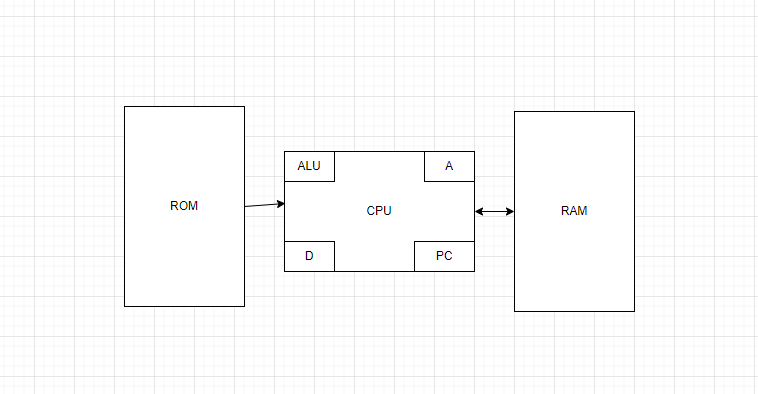

# Diagrama

### **Componentes principales de la arquitectura Hack**  

#### **1. CPU: Partes principales**
La CPU del computador Hack incluye los siguientes componentes clave:  
- **ALU (Unidad Aritmética y Lógica):**  
   Realiza operaciones aritméticas y lógicas, como suma, resta, negación y operaciones booleanas. Trabaja con datos provenientes de registros o memoria.  
- **Registro A:**  
   Sirve para almacenar direcciones de memoria o valores constantes. Dependiendo del contexto, su contenido puede ser interpretado como un dato o una dirección en memoria.  
- **Registro D:**  
   Exclusivamente almacena datos. Es usado para cálculos y como intermediario en operaciones con la ALU.  
- **PC (Contador de Programa):**  
   Contiene la dirección de la siguiente instrucción a ejecutar, asegurando que el flujo del programa sea continuo.  

---

#### **2. Memoria: Organización**
- **Memoria dividida en dos partes principales:**  
  - **ROM (Read-Only Memory):**  
    Contiene las instrucciones del programa. Es de solo lectura y tiene un espacio direccionable de 32K palabras (15 bits).  
  - **RAM (Random Access Memory):**  
    Almacena datos y variables en tiempo de ejecución. También tiene 32K palabras disponibles.  

- **Mapa de memoria:**  
   Una porción específica de la RAM está asignada para **dispositivos de entrada/salida (I/O):**  
   - **Pantalla:** Mapeada desde la dirección `16384 (0x4000)` hasta `24575 (0x5FFF)`. Cada bit representa un píxel (1 = negro, 0 = blanco).  
   - **Teclado:** Mapeado en la dirección `24576 (0x6000)`. Cuando una tecla es presionada, su código ASCII se almacena aquí.  

---

#### **3. Registros A y D: Funciones y diferencias**
- **Registro A:**  
   - Puede almacenar valores constantes o actuar como un puntero para acceder a una dirección de memoria.  
   - Es esencial para indicar qué posición de memoria se utiliza en operaciones posteriores.  
   - También sirve para manejar saltos (*jumps*) en el programa, apuntando a la dirección de la instrucción destino.  

- **Registro D:**  
   - Exclusivo para almacenar datos intermedios.  
   - Se usa como operando para cálculos en la ALU.  

**Diferencia clave:**  
El registro **A** puede representar direcciones de memoria, mientras que el registro **D** es puramente un registro de datos.

---

#### **4. Contador de Programa (PC): Función en el ciclo Fetch-Decode-Execute**
El **PC (Program Counter)** tiene un rol crucial en el ciclo de ejecución:  
1. **Fetch (Obtener):**  
   El PC apunta a la dirección en la ROM donde se encuentra la instrucción actual.  
2. **Decode (Decodificar):**  
   La instrucción es leída y su significado es interpretado para determinar la operación que debe ejecutarse.  
3. **Execute (Ejecutar):**  
   Dependiendo de la instrucción, el PC puede incrementarse (para seguir el flujo lineal) o actualizarse (en caso de un salto o condicional).  

El PC asegura que las instrucciones se ejecuten en el orden correcto o sigan la lógica del programa en caso de bucles o condicionales.

