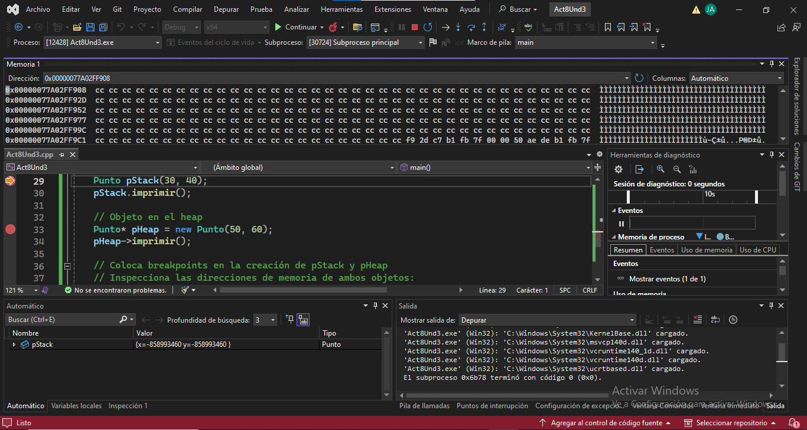
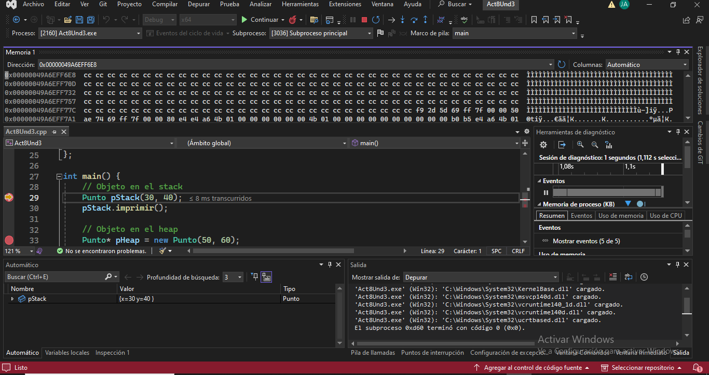

# 📌 Diferencia entre Objetos en el Stack y en el Heap

## 🚀 Stack (Pila)
```cpp
Punto pStack(30, 40);

✔ Se almacena directamente en la memoria de la pila.
✔ Se gestiona automáticamente (se destruye al salir del main).
✔ Más rápido y eficiente.

🔥 Heap (Montículo)
Punto* pHeap = new Punto(50, 60);
✔ Se almacena en la memoria dinámica (heap).
✔ Necesita ser eliminado manualmente con delete.
✔ Más flexible, pero más lento.

🎯 ¿pStack es un objeto o una referencia a un objeto?
✅ Es un objeto.

Se almacena directamente en la pila.

No es un puntero ni una referencia.

🎯 ¿pHeap es un objeto o una referencia a un objeto?
✅ Es un puntero a un objeto.

Hace referencia a un objeto de tipo Punto que fue creado en el heap.

🛠 Observación en Memory1 y Locals (Depuración en Visual Studio)
📌 Memory1 (Debug -> Windows -> Memory -> Memory1)
✔ Se muestra la dirección de memoria donde se almacena el puntero pHeap.

📌 Locals (Debug -> Windows -> Locals)
✔ Se observa:

pHeap → Muestra la dirección del objeto en el Heap.

*pHeap → Muestra los valores del objeto (x = 50, y = 60).

🔍 ¿Qué significa esto?
✔ pHeap almacena la dirección del objeto en el heap.
✔ *pHeap accede al objeto al que apunta.
✔ La dirección en Memory1 indica que pHeap es solo un puntero, no el objeto en sí.

✅ Conclusión
✅ Los objetos en el Stack son más rápidos y fáciles de gestionar.
✅ Los objetos en el Heap son más flexibles, pero requieren manejo manual de memoria (delete).
```
