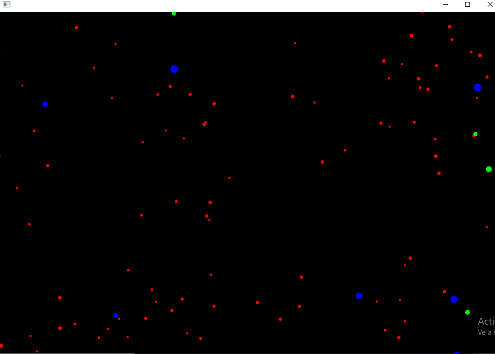

### Describe con tus propias palabras el comportamiento general de la aplicación. ¿Qué ves en pantalla?
- En la pantalla al ejecutar el codigo se ven unas particulas de colores
### ¿Cómo puedes interactuar con la aplicación? Menciona específicamente las teclas y qué efecto parecen tener sobre las partículas.
- Mediante las teclas ( a , r , s , n ), a contrae las particulas, r las expande , n cambia su trayectoria inmediatamente , y s las detiene
### ¿Observas diferentes tipos de “partículas” (elementos visuales)? ¿Se comportan todas igual inicialmente?
- Se observan particulas de diferentes tamaños y formas y todas hacen caso a las mismas condiciones de las teclas
### Capturas 

### ¿Qué crees que está pasando “detrás de cámaras” cuando presionas las teclas? Formula una hipótesis inicial sobre cómo la aplicación cambia el comportamiento de las partículas.
- Cuando el usuario presiona una tecla, la aplicación emite un evento a través de alguna estructura y cada partícula reacciona cambiando su estado interno, lo que modifica su comportamiento de movimiento en la aplicación.
